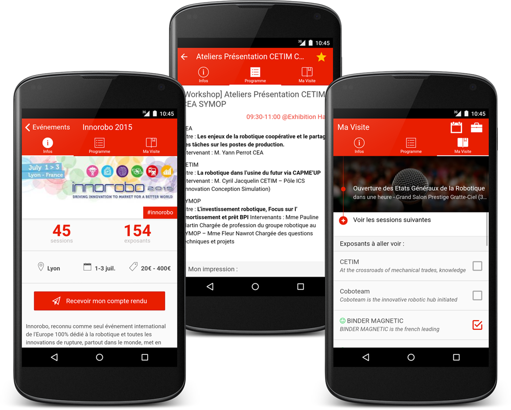

# Your next event app

SalooN est une application open-source qui a pour but d'aider les participants à une conférence à planifier et suivre leur programme.

L'application est téléchargeable sur le [Play Store](https://play.google.com/store/apps/details?id=co.saloonapp.eventexplorer) et sur l'[App Store](https://itunes.apple.com/fr/app/saloon-events/id999897097).

Pour toute demande de fonctionnalité ou signalement de bug, les issues et pull-request sont à votre disposition :)

Si une conférence vous intéresse et n'est pas présente, n'hésitez pas à [nous contacter](http://saloonapp.herokuapp.com/#contact). Nous ferons notre possible pour l'ajouter en temps et en heures.

## Technical

This application (mostly) follows the [John Papa's style guide](https://github.com/johnpapa/angular-styleguide).

### Getting started

- install nodejs, npm, gulp, bower, cordova, ionic & sass (if not already done)
- clone this repo and go to folder
- `bower install` : install app dependencies
- `npm install` : install build dependencies
- `ionic setup sass` : use sass
- `ionic serve` : start the app on your browser

To run the app on your android device :

- `ionic platform add android` : add android platform to the project
- `ionic resources` : generate icon & splash-screen for project platforms
- `ionic run android` : run your app !

### TODO

- enregistrer le pushId
- improve ng-repeat performance with "track by"
- mieux gérer le cache (chargement, refresh, LocalStorage vs SQLite...)

### Infos

#### Android debug

- android remote debug : https://developer.chrome.com/devtools/docs/remote-debugging
- activate developer mode on android

#### Specific urls

Use these custom urls to open other apps using inappbrowser (org.apache.cordova.inappbrowser)

- "tel:0123456789" => call this number
- "sms:0123456789?body=coucou" => send sms to this number
- "geo:lat,lon" => open google map to this geoloc
- "mailto:toto@example.com" => send an email
- "market:???"

see http://stackoverflow.com/questions/26271313/tel-sms-and-mailto-no-longer-working-in-android-after-upgrading-to-cordo

#### Other links

- Push
    - https://github.com/hollyschinsky/PushNotificationSample
- Unit test
    - https://bradb.net/unit-testing-with-the-ionic-framework/
    - http://forum.ionicframework.com/t/ionic-and-karma-unittest/8799
- Data
    - PouchDB (http://devgirl.org/2014/12/30/sync-data-using-pouchdb-in-your-ionic-framework-app/)
- Tracking solutions :
    - https://github.com/danwilson/google-analytics-plugin
    - http://luisfarzati.github.io/angulartics/ (with segment.io)
